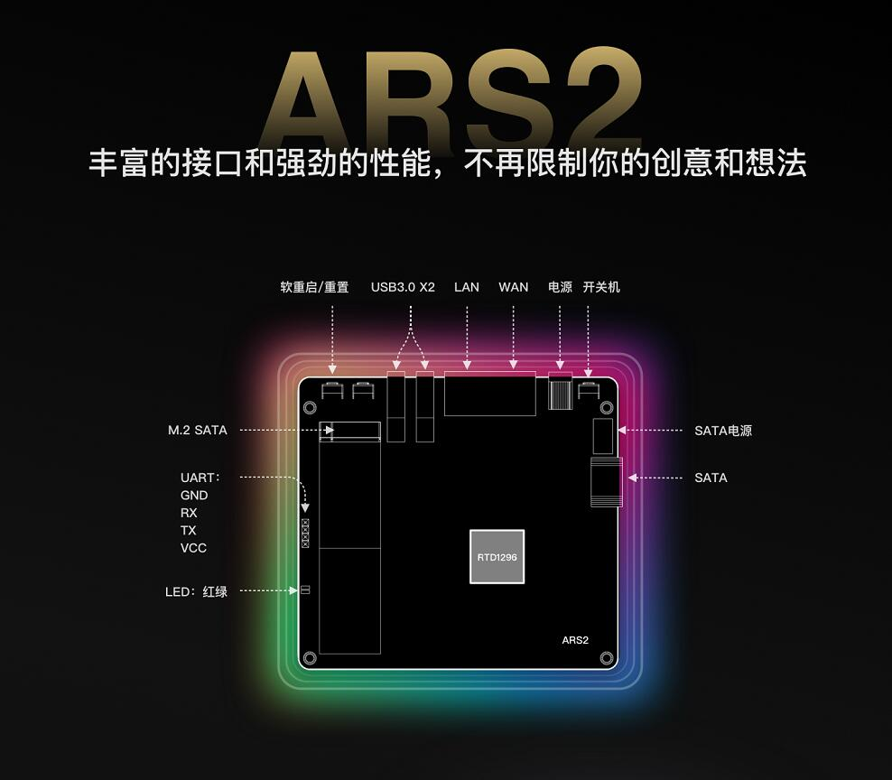
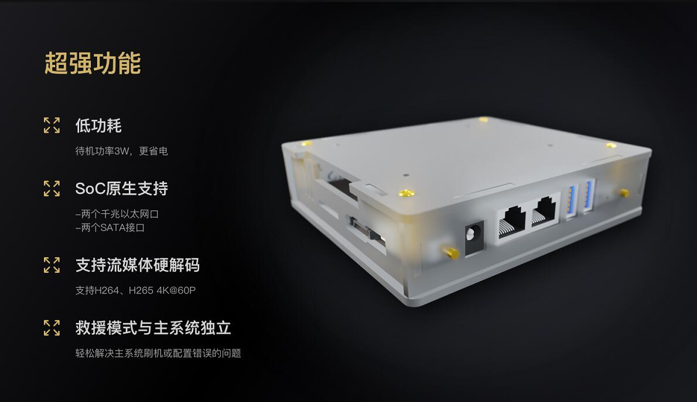
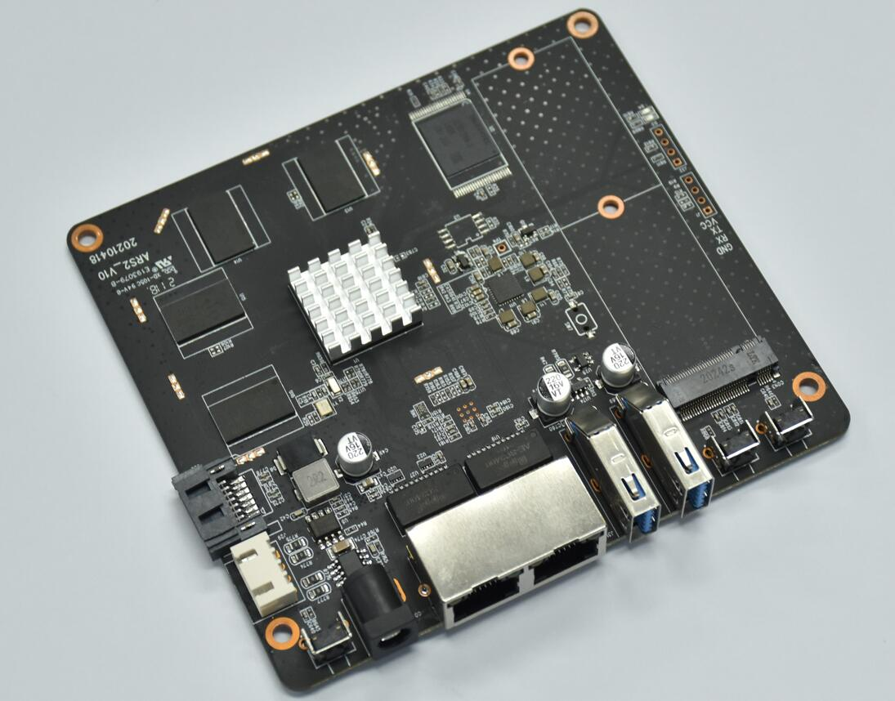

## EasePi介绍

EasePi 由 [KoolShare](https://koolshare.cn/space-uid-2380.html) @小宝带领的易有云团队，推出的基于RTD1296处理器且带存储的软路由开发版。

 

 

## 硬件预览

CPU：Realtek 1296，标准64位ARM cortex-A53核心CPU，搭载采用16纳米工艺T820三核版GPU，最高工作频率为1.5 GHz。

内存：板载4G，超大内存。

存储：板载8G eMMC，摆脱TF卡，刷机折腾更方便。

网口：原生双千兆，极速体验上网娱乐游戏。

USB：双USB3.0，外接设备不用怕。

硬盘：1个常规sata硬盘接口和供电接口、1个M.2的sata固态接口，全方位扩展存储。

电源：DC 5V/2A，待机功率3W，更省电。

开关：电源开关、软重启/重置开关。

扩展：TTL预留孔位，方便极客。

LED：指示灯全方位监控设备，设备情况一目了然。

 

## 软件预览

主流硬件解码，支持H264、H265 4k@60P等。

独立的救援模式，轻松解决主机系统崩坏问题。

软路由+NAS的完美融合，既是路由，又能做家庭NAS。

DDNSTO和易有云的完美兼容，给你带来更愉快的体验。

## 强大支持

官方提供稳定固件，开放更多玩法，开放SDK，极客可随意定制路由系统。

